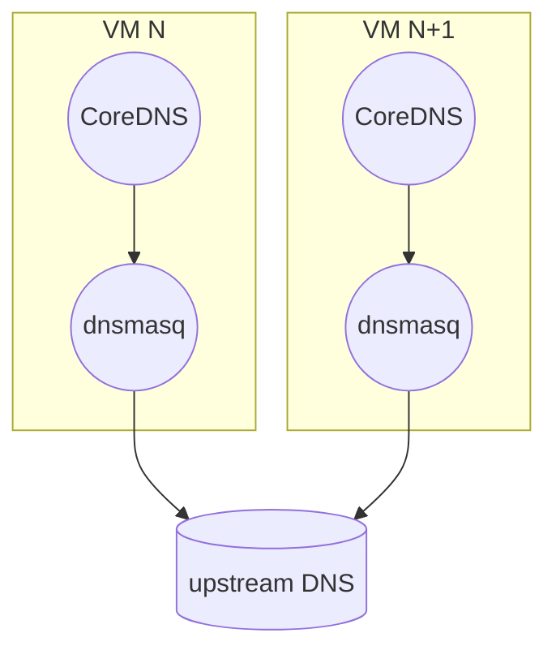
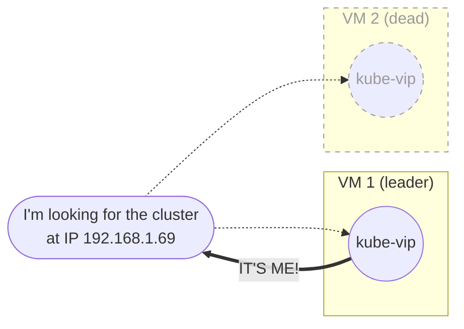

[< back](../README.md)

# 20-bootstrap

In this stage we run [Ansible](https://docs.ansible.com) against the VMs from `10-infra` and leave behind a working k3s cluster.

- node OS configuration
- one [dnsmasq](https://thekelleys.org.uk/dnsmasq/doc.html) instance per VM
- [kube-vip](https://kube-vip.io) for the floating VIPs
- [k3s](https://k3s.io) itself, and the [Tailscale](https://tailscale.com) VPN for remote access

## DNS

Every VM runs its own dnsmasq: it answers the lab's internal names and forwards everything else to upstream DNS servers. The reason for having dnsmasq on each VM is to make it such that the cluster doesnt depend on any single DNS node.

## High availability

Having high availability _within_ the k3s cluster is very easy. But when it comes to accessing the cluster from the LAN it's different.

I can't point `kubectl` at any single node IP, because if that node goes down I lose access. Same goes for applications that are exposed to the LAN only through [Traefik](https://traefik.io).

Therefore I created a floating virtual IP for the control plane, and one for Traefik. The nodes periodically elect a leader node for each VIP, and that node will answer ARP requests as long as it is the leader. When a node goes down, another leader is elected and the VIP moves.

This way all my tools and applications can point at a single IP, and I am guaranteed that its answered by a live node.

