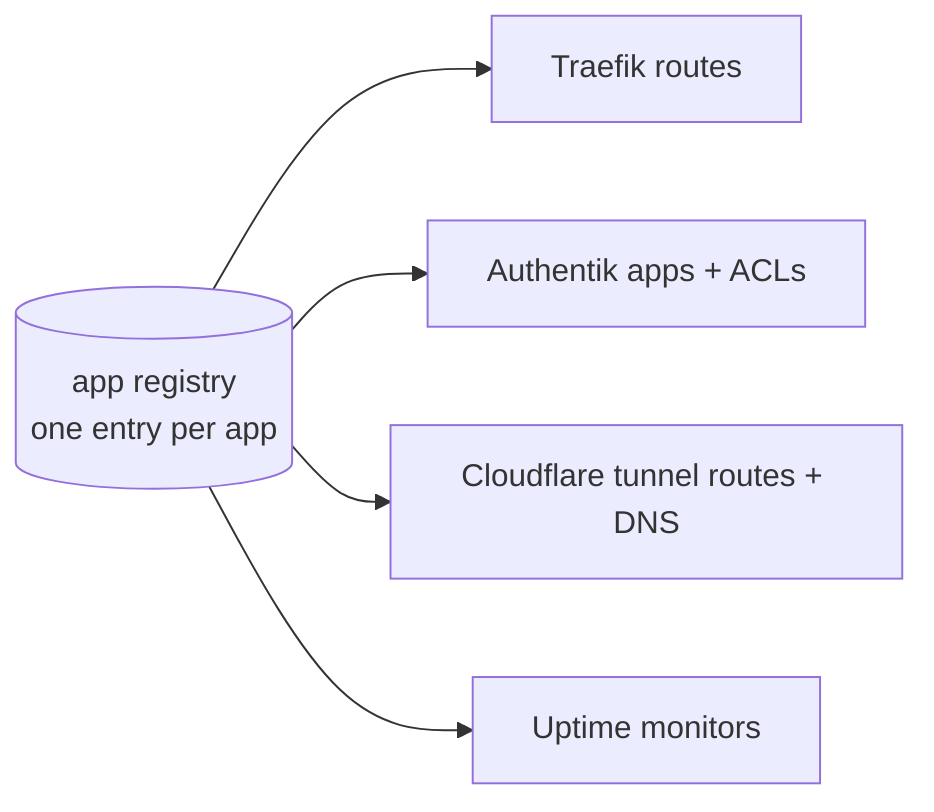
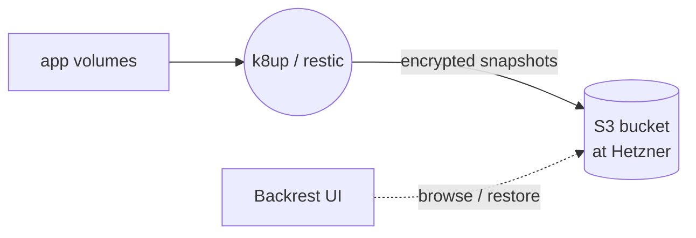
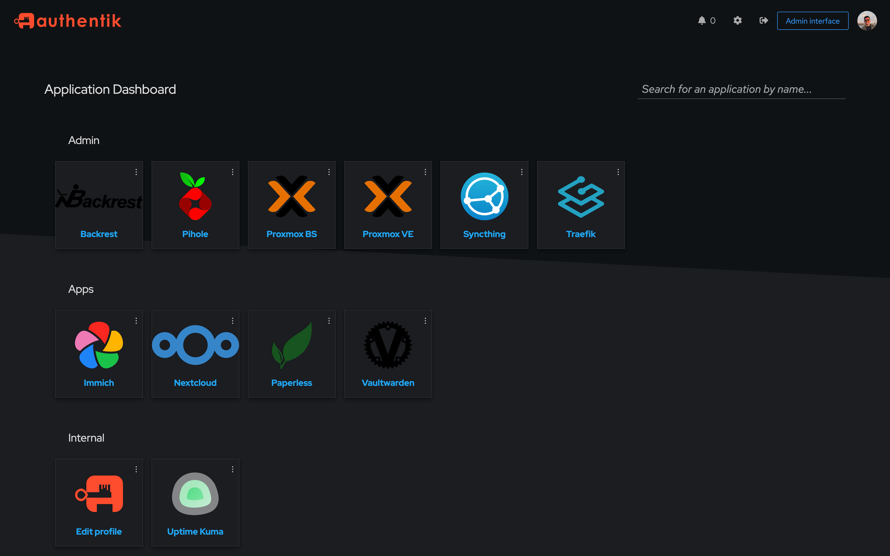
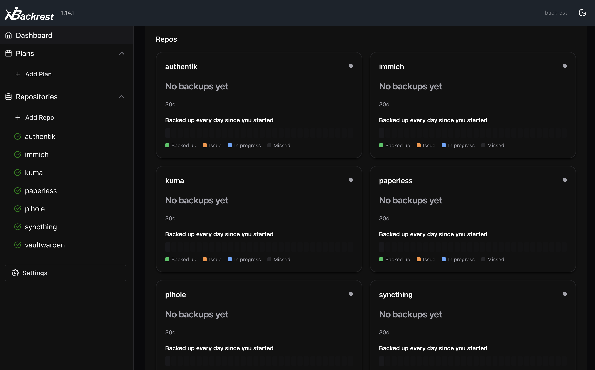

[< back](../README.md)

# 30-applications

In this stage we deploy everything that runs on the cluster. Each app is a [helmfile](https://helmfile.readthedocs.io) release, optionally paired with a [tofu](https://opentofu.org) root for the configuration that lives inside other systems (Authentik objects, DNS records, tunnel routes, uptime monitors).

- [csi-proxmox](https://github.com/sergelogvinov/proxmox-csi-plugin) for having PVs as Proxmox disks that can move across nodes
- [cert-manager](https://cert-manager.io) with a wildcard certificate
- [Traefik](https://traefik.io) as ingress
- [Authentik](https://goauthentik.io) for SSO and access control
- [Uptime Kuma](https://github.com/louislam/uptime-kuma) for monitoring
- [Cloudflare tunnel](https://developers.cloudflare.com/cloudflare-one/connections/connect-networks/) to expose selected apps to the internet
- [Pi-hole](https://pi-hole.net) as the user-facing DNS server
- all other apps

## The app registry

I declare applications in a single global "registry" file. One entry defines an app's hostnames, auth mode, dashboard appearance, ACLs and uptime probe.

Adding an app means writing one registry entry and its release directory.

## Backups

Every stateful app carries a [k8up](https://k8up.io) schedule: [restic](https://restic.net) backs up its volumes every night to an S3 bucket at [Hetzner](https://www.hetzner.com), so backups are encrypted and leave the house. Apps where copying files isn't enough (databases) declare a dump command instead, and that's what gets backed up. Snapshots are integrity-checked and pruned on their own schedules.

[Backrest](https://github.com/garethgeorge/backrest) serves a web UI over the same repositories, so I can browse snapshots and pull single files back out without touching the restic CLI.

For now the backup setup is a bit icky in my opinion, but it works. Once I have distributed storage through Ceph, backups will be easier to manage.

## Ordering

Some applications depend on other applications. I could have expressed dependencies in the helmfile, but deploying an application is often more than its helm release: some also run a tofu apply, and helmfile can't order those. So the dependency graph lives in the [Makefile](./Makefile) instead, which orchestrates the order of deployment. It's definitely a smell, so if I find a better way this goes immediately.

## Screenshots

### _Authentik dashboard_

### _Backrest dashboard_

