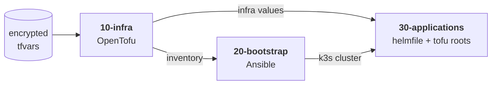

# Homelab

This repository holds my Homelab setup. It's mostly composed of [OpenTofu](https://opentofu.org), [Ansible](https://docs.ansible.com), [Helm](https://helm.sh) amongst other things. I probably went a bit overboard with automation as I made sure I can go from nothing to VMs, networking, DNS, a [k3s](https://k3s.io) cluster, and the applications on it with a single `make` command. My homelab mostly serves as a playground for me to learn and experiment with new toys. This is my first experience with kubernetes so you might find a lot of things that are not best practice.

There are three rules I try to stick to. The lab must be rebuildable from scratch: a fresh clone plus one [age](https://github.com/FiloSottile/age) key is enough, since inputs, secrets and tofu state(s) are committed encrypted. Wiring has a single source of truth: every hostname, address and credential lives in one encrypted tfvars set, and stages talk to each other only through files generated from it. And high availability is done on the cheap: three k3s servers and floating VIPs mean any single VM can fail without taking the cluster with it.

## The pipeline

The numbered directories are the deploy order and `make` walks them; each stage produces values that the next stage consumes. The stages are:

- [`10-infra`](10-infra/README.md) turns tfvars into Proxmox VMs, network bridges, S3 buckets and Ansible inventory.
- [`20-bootstrap`](20-bootstrap/README.md) configures the VMs: the k3s cluster, DNS, floating VIPs for HA etc.
- [`30-applications`](30-applications/README.md) deploys storage, certificates, ingress, identity and the apps behind them.

Each stage has its own README going deeper into its design.

## Working in the repo

This repo ships a [devbox](https://www.jetify.com/devbox) environment for all tools used in the pipeline (see [devbox.json](devbox.json)). When working, always activate the devbox shell by running `devbox shell`.

### Secrets

Secrets (and anything else I'd rather not have sitting in cleartext on a public repo) are encrypted with [SOPS](https://github.com/getsops/sops) and committed. Every file with `.enc` in its name is SOPS-encrypted. k3s Secrets use `.k3ssecret.enc`: instead of being fully encrypted, they keep their metadata in cleartext.

The workflow:

1. Supply the SOPS key in [`.sops/keys.txt`](.sops/keys.txt)
1. `devbox shell`
1. `devbox run sops-open` to decrypt secrets in place
1. do dev/deploy/whatever
1. `devbox run sops-stage` to stage the encrypted secrets for commit

A pre-commit hook (installed automatically by the devbox shell) checks that no unencrypted secrets are staged for commit.

### Deploying

I use Makefiles for deploying stuff. This will probably come back to bite me. I will eventually move to GitOps sometime in the future. The numbered directories are the pipeline, and `make stages` goes through them in order. Each stage, and each app under `30-applications`, has its own Makefile; running `make` there deploys just that piece independently.
